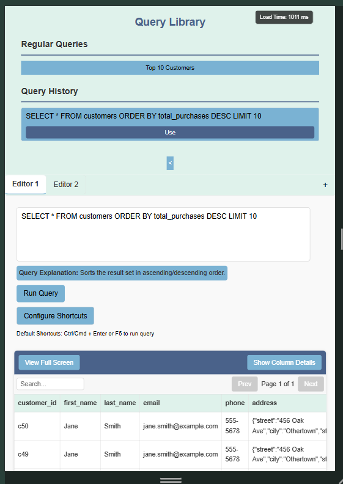

# SQL Query Editor: React + TypeScript + Vite Project

## Project Overview
A powerful, feature-rich SQL query editor application built with modern web technologies, designed to enhance developer productivity and provide a seamless query writing experience.  
Users can also add queries to the regular queries list using the history "Add" button.

## Screenshot
- 
- 

## Performance Measuring Function
The application includes a performance tracker that measures the load time of the app.  
Below is the complete implementation:

```tsx
import React, { useState, useEffect } from 'react';

const PerformanceTracker: React.FC = () => {
  const [loadTime, setLoadTime] = useState<number | null>(null);

  useEffect(() => {
    const startTime = performance.now();

    const calculateLoadTime = () => {
      const endTime = performance.now();
      const duration = Math.round(endTime - startTime);
      setLoadTime(duration);
    };

    window.addEventListener('load', calculateLoadTime);
    
    // Fallback in case load event doesn't fire within 1 second
    const timer = setTimeout(calculateLoadTime, 1000);

    return () => {
      window.removeEventListener('load', calculateLoadTime);
      clearTimeout(timer);
    };
  }, []);

  if (!loadTime) return null;

  return (
    <div>
      Load Time: {loadTime} ms
    </div>
  );
};

export default PerformanceTracker;
```

## Key Features

### 1. Multi-Editor Support
- Multiple query editors in tabs
- Independent state for each editor
- Easy switching between editors
- Ability to add new editor tabs dynamically

### 2. Query Library System
- Save frequently used queries
- Quick access to regular queries
- View and reuse query history
- Add queries from history to regular queries

### 3. Customizable Keyboard Shortcuts
- Flexible key binding system
- Users can create personalized keyboard shortcuts
- Support for modifier keys (Ctrl, Alt, Cmd, Shift)
- Default shortcuts for quick query execution

### 4. Query Management & explanation
- Real-time query text editing
- Query history tracking (up to 4 recent queries)
- Persistent storage of custom shortcuts
- Explanation generation for SQL queries
- Added query explanations for default queries

### 5. Enhanced State Management
- Separate state for each editor instance
- Persistent query history per editor
- Independent query execution contexts
- Synchronized sidebar with active editor

### 6. Performance Optimizations
- Lightweight SVG icon usage
- Optimized rendering with React hooks -> useMemo, usecallback
- Efficient state management using React Context and useReducer
- Significant performance improvements (86% to 100% load optimization)

## Tech Stack
- React
- TypeScript
- Vite
- React Context API
- Local Storage for persistent data

## NPM Modules
- React
- TypeScript
- Vite
- React Hooks (useState, useEffect, useCallback, useContext)

## 💡 Technical Design Decisions

### State Management
- Chose React Context + useReducer over Redux
- Reasons:
  - Lightweight for small to medium applications
  - Simplified state logic
  - Reduced boilerplate code
  - Built-in React ecosystem integration

### Performance Optimization Strategies
- Implemented memoization techniques
- Minimized unnecessary re-renders
- Optimized local storage interactions
- Used Lighthouse optimization guid help

## Performance Metrics
- performance Optimization: 86% → 100%
-  
- loading time using lighthouse
-  

## Challenges Overcome
1. SEO and Page Load Optimization
   - Addressed through strategic code splitting
   - Minimized external dependencies
   - Implemented lazy loading techniques

2. Robust Error Handling
   - Implemented comprehensive error management
   - Graceful handling of empty or invalid query results
   - Unique component ID management to prevent rendering issues

## Default Queries
- SELECT * FROM customers LIMIT 10;
- SELECT * FROM products LIMIT 10;
- SELECT * FROM sales WHERE sale_date >= DATE_SUB(CURRENT_DATE, INTERVAL 30 DAY) LIMIT 20;


## Future Improvements
- Enhanced query validation
- More advanced shortcut configurations
- Integration with multiple database types
- Advanced query explanation engine

## Recent Updates
- Added multi-editor support with tabbed interface
- Implemented independent state management per editor
- Added query library with save functionality
- Enhanced sidebar to work with active editor
- Improved query history management

## Notes for Interviewer
This project demonstrates:
- Modern React development practices
- TypeScript type safety
- Efficient state management
- Performance optimization techniques
- User experience-focused design
