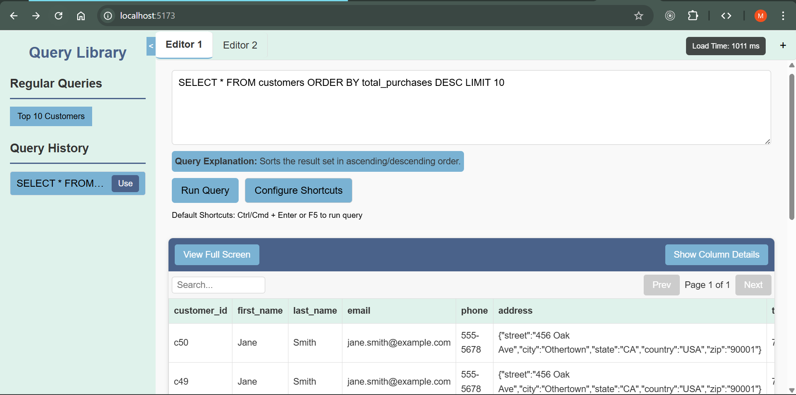

# SQL Query Editor: React + TypeScript + Vite Project

## Project Overview
A powerful, feature-rich SQL query editor application built with modern web technologies, designed to enhance developer productivity and provide a seamless query writing experience.
Can add to regular Queries by history add button,

## Screenshot

-  
-  

## Key Features

### 1. Customizable Keyboard Shortcuts
- Flexible key binding system
- Users can create personalized keyboard shortcuts
- Support for modifier keys (Ctrl, Alt, Cmd, Shift)
- Default shortcuts for quick query execution

### 2. Query Management & explanation
- Real-time query text editing
- Query history tracking (up to 4 recent queries)
- Persistent storage of custom shortcuts
- Explanation generation for SQL queries
- Added query explanations for default queries

### 3. Performance Optimizations
- Lightweight SVG icon usage
- Optimized rendering with React hooks -> useMemo, usecallback
- Efficient state management using React Context and useReducer
- Significant performance improvements (86% to 100% load optimization)

## Tech Stack
- React
- TypeScript
- Vite
- React Context API
- Local Storage for persistent data

## NPM Modules
- React
- TypeScript
- Vite
- React Hooks (useState, useEffect, useCallback, useContext)

## 💡 Technical Design Decisions

### State Management
- Chose React Context + useReducer over Redux
- Reasons:
  - Lightweight for small to medium applications
  - Simplified state logic
  - Reduced boilerplate code
  - Built-in React ecosystem integration

### Performance Optimization Strategies
- Implemented memoization techniques
- Minimized unnecessary re-renders
- Optimized local storage interactions
- Used Lighthouse optimization guid help

## Performance Metrics
- Initial Load Time Optimization: 86% → 96%
- 
- Optimized to
-  
- loading time using lighthouse
-  

## Challenges Overcome
1. SEO and Page Load Optimization
   - Addressed through strategic code splitting
   - Minimized external dependencies
   - Implemented lazy loading techniques

2. Robust Error Handling
   - Implemented comprehensive error management
   - Graceful handling of empty or invalid query results
   - Unique component ID management to prevent rendering issues

## Default Queries
- SELECT * FROM customers LIMIT 10;
- SELECT * FROM products LIMIT 10;
- SELECT * FROM sales WHERE sale_date >= DATE_SUB(CURRENT_DATE, INTERVAL 30 DAY) LIMIT 20;

## Future Improvements
- Enhanced query validation
- More advanced shortcut configurations
- Integration with multiple database types
- Advanced query explanation engine

## Notes for Interviewer
This project demonstrates:
- Modern React development practices
- TypeScript type safety
- Efficient state management
- Performance optimization techniques
- User experience-focused design
